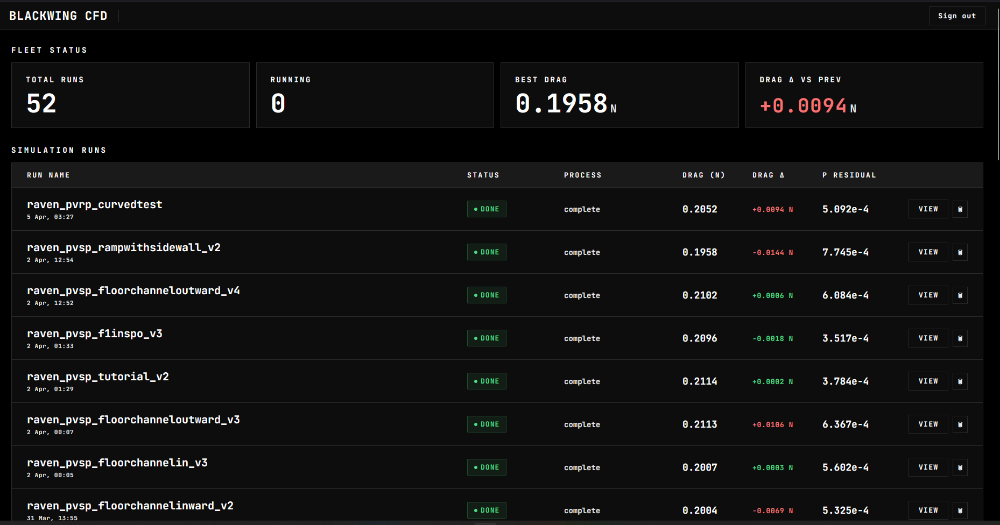

# OpenFOAM for STEM Racing

Run CFD simulations on your STEM racing car, entirely in the cloud, and get results in a live website.



[](https://discord.com/users/749536347961950321)

**Stack:** Fusion 360 → Python orchestrator → AWS EC2 (OpenFOAM 13) → Firebase (Firestore + Storage + Hosting) → Three.js / Chart.js dashboard

---

> **New to the project?** Start with **[SETUP.md](SETUP.md)** — it walks you through every step from zero to your first simulation.
> **Looking for reference docs?** See **[DOCS.md](DOCS.md)** — dashboard metrics, Firebase structure, OpenFOAM settings, and the ParaView visualisation guide.

---

## Table of Contents

1. [What it does](#what-it-does)
2. [Architecture](#architecture)
3. [Prerequisites](#prerequisites)
4. [Limitations](#limitations)
5. [CFD software comparison](#cfd-software-comparison)
6. [Usage tutorial](#usage-tutorial)
7. [OpenFOAM configuration](#openfoam-configuration)
8. [Scaling the instance pool](#scaling-the-instance-pool)
9. [Changing the password](#changing-the-password)
10. [Contributing](#contributing)
11. [Troubleshooting](#troubleshooting)

---

## What it does

| Step | What happens |
|------|-------------|
| **Export** | A Fusion 360 macro (`export_stls.py`) tessellates and exports your car body and wheels as binary STL files |
| **Launch** | `aws_study.py` uploads the STLs to Firebase Storage, picks a free EC2 instance from your pool, starts it, and SSHes in to begin the job |
| **Simulate** | `run_job.py` runs on EC2: two-stage OpenFOAM pipeline (coarse mesh → fine mesh with boundary layers + field mapping), k-ω SST turbulence model |
| **Store** | Results CSV (drag / lift / pressure residual per iteration) and the solved STL are uploaded back to Firebase Storage; job status is written to Firestore in real time |
| **Visualise** | The web dashboard streams live iteration progress, renders a 3D STL viewer (Three.js), and plots force and residual graphs (Chart.js) |

---

## Architecture

```
Windows (your laptop)
├── Fusion 360
│   └── export_stls.py        — tessellate bodies, export STLs
└── aws_study.py              — orchestrator

Firebase (Google Cloud)
├── Firestore                 — real-time job status documents
├── Storage                   — STL files, results CSVs, solver logs
└── Hosting                   — static web dashboard

AWS (ap-south-1 or your region)
└── EC2 c6g.2xlarge pool      — OpenFOAM 13, runs run_job.py
```

---

## Prerequisites

| Requirement | Notes |
|-------------|-------|
| [Firebase](https://console.firebase.google.com) account | Free Spark plan is fine to start |
| [AWS](https://aws.amazon.com) account | EC2 c6g.2xlarge is ~$0.34/hr |
| [Autodesk Fusion 360](https://www.autodesk.com/products/fusion-360) | For the CAD export macro |
| Python 3.9+ on Windows | For the orchestrator |
| [Node.js](https://nodejs.org) 18+ | Required by the Firebase CLI |
| [Firebase CLI](https://firebase.google.com/docs/cli) | `npm install -g firebase-tools` |

**Python packages:**
```bash
pip install boto3 paramiko requests python-dotenv
```

> See [SETUP.md](SETUP.md) for full installation and configuration instructions.

---

## Limitations

- **No automatic instance launch** — instances must be manually created in the AWS console and added to the `EC2_INSTANCES` list in `aws_study.py`. The orchestrator picks a stopped instance from a pre-built pool; it does not launch new instances from scratch on demand. This was built for internal use and we never expected to release it publicly.
- **Manual pool sizing** — if all pool instances are busy, the orchestrator waits until one becomes free. Adding capacity means launching a new instance from the AMI and updating the config.
- **Single shared password** — there are no per-user accounts. Everyone on the team uses the same password.
- **One job per instance** — each EC2 instance runs one simulation at a time. Throughput scales linearly with pool size.
- **CPU-Based AWS Only** - This is currently just limited to AWS CPU-based compute. If you ever need to accelerate the speed, you might want to check out OpenFOAM's community forks related to GPU-based acceleration. And if you ever run out of the free 200 dollars that AWS gives, switch to Oracle Cloud, Azure, or Google Cloud. (You'lle have to do a fair bit of tinkering with the code though).
- **Firebase Based** - We thought that the additional complexity of something like a PortgreSQL based system (like supabase) was never needed for just our team use. However, if you do ever make it work for Supabase / SQL, please create a fork and a pull request. 

---

## CFD software comparison

A breakdown of every CFD option we evaluated for STEM racing, and why we ended up building this instead of using any of them off the shelf.

### Quick comparison

| Software | Accuracy | Setup time per sim | Runs locally on your PC | Verdict |
|----------|----------|--------------------|------------------------|---------|
| Ansys Discovery | Unreliable (±3N error) | Fast | Yes | Avoid entirely |
| Ansys Fluent | Very good | 1h+ per sim | Yes | Too slow for iterative design |
| SimScale | Poor convergence | Easy | No | Not reliable enough for race results |
| Simcenter Star-CCM+ | Very good | Low | No (cloud capable) | Great software, near-impossible to license |
| Autodesk CFD | Mediocre | Very slow | Yes | Not worth the setup time |
| SolidWorks CFD | Below SimScale | Easy | Yes | Not accurate enough |
| **OpenFOAM (this repo)** | Good | Fully automated | No | Best option for STEM racing |

---

### Ansys Discovery


Avoid. Discovery's fast simulation mode aggressively approximates the physics in ways that make results unreliable for external aerodynamics. We consistently saw drag errors as large as 3N in either direction on the same geometry — meaning it can tell you drag went up when it actually went down. You also have very little control over mesh quality, solver settings, or convergence criteria. It is not a useful tool for any serious aerodynamic analysis on a STEM car.

---

### Ansys Fluent


Genuinely accurate and widely used in industry — the solver quality is not in question. The problem is the workflow. Each simulation takes well over an hour just to set up from scratch, and then 3+ hours to solve, running locally on your PC the entire time. Your machine is completely unusable while it runs. For iterative STEM car development where you might want to test 10 design variants in a weekend, this is a major bottleneck. Great software, wrong tool for this use case.

---

### SimScale


Easy to set up and fully cloud-based, so it does not tie up your PC — both genuine advantages. However, drag results consistently fail to stabilise in our experience. Getting any hope of convergence requires 3000+ iterations, and even then p residuals rarely drop below 1e-2, which is too high to trust the drag and lift numbers for design decisions.

This is not purely a SimScale problem — it stems from limited solver customisation. SimScale uses an OpenFOAM backend with a custom geometry engine, but it does not expose the mesh controls needed to get reliable convergence efficiently. Our approach addresses this directly: we run a fast coarse mesh solve first, then map the converged pressure and velocity fields onto the fine mesh as a starting condition. The fine run begins from a good initial state rather than from zero, which typically cuts the iterations needed for fine-mesh convergence from 5000+ down to around 1500 — a significant saving in both time and compute cost.

---

### Simcenter Star-CCM+


Technically one of the best CFD packages available. Setup time per simulation is low relative to Fluent, the solver is very accurate, and it supports cloud execution so it does not have to run on your local machine. If you can get access to it, it is a strong option for STEM racing.

The problem is licensing. Star-CCM+ licenses are expensive and typically tied to universities or large engineering organisations. Getting a license as a STEM team is extremely difficult in practice. If your school or sponsor happens to have access, it is worth exploring — but for most teams it is not a realistic option.

---

### Autodesk CFD


Setup is slow and cumbersome — each simulation requires significant manual configuration before you can even run it. Once running, it executes locally on your PC, tying up your machine for the duration of the solve. Accuracy is mediocre and not significantly better than SolidWorks CFD. The combination of high setup overhead and local compute makes it hard to justify over the other options.

---

### SolidWorks CFD


Easier to set up than most of the other local solvers and meaningfully more accurate than Ansys Discovery, but it still falls short of SimScale-level results — which are already not reliable enough for confident design decisions. Runs locally on your PC, so your machine is occupied during the solve. A reasonable starting point if you are already in the SolidWorks ecosystem, but not accurate enough to base final design choices on.

---

### OpenFOAM (this repo)


OpenFOAM on cloud EC2 instances is the best option we found for STEM racing. The entire workflow is automated — export your STLs from Fusion 360, run one command, and your PC is free while the simulation runs in the cloud. With the right mesh setup, results are reliable: we consistently achieved p residuals below 1e-4 across more than 200 runs.

The core advantage over SimScale's OpenFOAM backend is the coarse-to-fine field mapping pipeline. The orchestrator runs a coarse mesh solve first to get an approximate converged solution, then maps those pressure and velocity fields onto the fine mesh as the starting condition for the fine run. This avoids the thousands of iterations a fine mesh would otherwise spend just reaching a plausible initial state, cutting total solve time significantly without sacrificing accuracy on the final result.

---

## Usage tutorial

### Step 1 – Export STLs from Fusion 360

1. Open your car design in Fusion 360
2. Open the **Scripts and Add-Ins** panel (`Shift+S`)
3. Click **Add** and point it at `orchestrator/export_stls.py` from this repo
4. Run the script — it will export `car_body.stl` and wheel STLs to a timestamped folder on your Desktop
5. Note the output folder path — you pass it to the orchestrator next

---

### Step 2 – Launch a simulation

```bash
python orchestrator/aws_study.py "C:\Users\you\Desktop\car_stls\run_01"
```

The orchestrator will:

1. Upload the STL files to Firebase Storage
2. Create a job document in Firestore (`status: queued`)
3. Find the first stopped EC2 instance in your pool
4. Start it and wait for it to come online (~60–90 s)
5. SSH in, upload `run_job.py`, and launch the solver in a `screen` session
6. Stream live logs to your terminal

You can close the terminal after the job starts — the EC2 instance runs independently and writes progress to Firestore. The instance stops itself when the job completes.

---

### Step 3 – Monitor in the dashboard

Open your Firebase Hosting URL and enter your team password.

The **Jobs** table updates in real time (Firestore `onSnapshot`). Each row shows:

| Column | Meaning |
|--------|---------|
| **Status** | `queued` → `coarse_mesh` → `coarse_solving` → `fine_mesh` → `fine_solving` → `done` / `failed` |
| **Drag Δ** | Change in drag force vs the previous run (green = better, red = worse) |
| **Drag** | Absolute drag force in Newtons (averaged over last 100 iterations) |
| **Residual** | Pressure residual (lower = more converged) |

Click any row to open the **detail panel**:

- **3D viewer** — interactive STL (right-click drag to rotate, middle-click to pan, scroll to zoom)
- **Force graph** — drag and lift force vs iteration
- **Residual graph** — log-scale pressure residual vs iteration
- **Cancel** button — sends a cancellation flag to Firestore; `run_job.py` polls this and kills the solver cleanly

---

### Step 4 – Read the results

When the job reaches `done`:

- **Drag force (N)** is averaged over the last 100 fine-mesh iterations — this is the primary figure of merit
- **Lift force (N)** — negative = downforce (good for racing)
- **Pressure residual** — should be below `1e-4` for a well-converged result; if it is still high consider increasing `endTime` in `controlDict`
- Download the **results CSV** for further analysis in Excel or Python
- Download the **STL** to visualise the geometry used for the simulation

#### Typical run times on c6g.2xlarge

| Stage | Time |
|-------|------|
| Instance startup | ~90 s |
| Coarse mesh (blockMesh + snappyHexMesh) | ~25 min |
| Coarse solve (500 iterations) | ~20 min |
| Fine mesh (snappyHexMesh + boundary layers) | ~40 min |
| Fine solve (1500 iterations) | ~50 min |
| **Total** | **~3 hours** |

---

## OpenFOAM configuration

The template lives in `openfoam_template/motorBike/`. Key settings you may want to tune:

| File | Setting | Default | Notes |
|------|---------|---------|-------|
| `system/controlDict` | `endTime` | `1500` | Iterations for the fine run |
| `system/controlDict` | `writeInterval` | `50` | How often results are written to disk |
| `0/U` | `Uinlet` | `(20 0 0)` | Wind speed in m/s |
| `system/snappyHexMeshDict` | `refinementLevel` | `(4 5)` | Surface refinement min/max |
| `system/snappyHexMeshDict` | `nSurfaceLayers` | `3` | Boundary layer count (fine run only) |

---

## Scaling the instance pool

1. Create a new AMI from `cfd-1` (or any working instance) after any software updates
2. Launch new `c6g.2xlarge` instances from the AMI
3. Assign Elastic IPs and attach the `openfoam-ec2-role` IAM role
4. Add them to the `EC2_INSTANCES` list in `orchestrator/aws_study.py`:

```python
{"name": "cfd-11", "instance_id": "i-0new..."},
```

The orchestrator always picks the first **stopped** instance, so the pool grows linearly.

---

## Changing the password

See **[DOCS.md — Changing the dashboard password](DOCS.md#1-changing-the-dashboard-password)** for full instructions.

---

## Contributing

1. Fork the repo and create a feature branch
2. Test with your own project and EC2 pool (do not commit credentials)
3. Open a pull request describing what you changed and why


---

## Troubleshooting

| Issue | Solution |
|-------|----------|
| "Could not reach database" on login | Check that `_config/access` exists in Firestore with a `passwordHash` field. Verify your `firebaseConfig` in `dashboard/index.html` matches your Firebase project. |
| Password doesn't work | Re-run the SHA-256 hash command and paste the exact output into the `passwordHash` field. |
| EC2 instance won't start | Verify the IAM role `openfoam-ec2-role` is attached, the instance tag `ManagedBy = openfoam-stemracing` is set, and the security group allows SSH from your IP. |
| Python script fails with "module not found" | Run `pip install boto3 paramiko requests python-dotenv` |
| Firestore permission denied | Re-run `firebase deploy` from the `dashboard/` folder and verify rules show a green checkmark in the Firebase console. |

---

> Built by the Blackwing team. Licensed under MIT.
